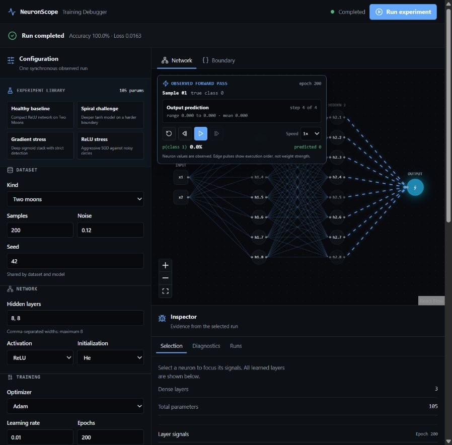
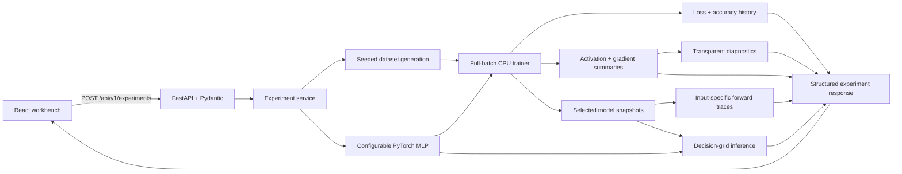

# NeuronScope

[](https://github.com/ompatelz/NeuronScope/actions/workflows/backend.yml)
[](https://github.com/ompatelz/NeuronScope/actions/workflows/frontend.yml)
[](https://github.com/ompatelz/NeuronScope/actions/workflows/containers.yml)
[](https://ompatelz.github.io/NeuronScope/)

NeuronScope is an interactive debugger for small neural-network training runs. Configure a binary
classifier, watch its decision boundary change, inspect layer-by-layer gradient and activation
statistics, and see evidence-backed warnings when learning behavior looks unhealthy.

The classification problem is deliberately visual and bounded. NeuronScope uses generated 2D
datasets so the model's predictions and internals—not data-cleaning ceremony—remain the focus.
Every chart, boundary cell, metric, and diagnostic shown in the workbench comes from a real PyTorch
run; the interface does not invent demonstration telemetry.

Try the public browser demo at <https://ompatelz.github.io/NeuronScope/>. GitHub Pages cannot run
the PyTorch API, so the hosted demo uses a labeled in-browser simulation for quick exploration.
Run the Docker image or local FastAPI service when you want the full PyTorch-backed workflow.

## Features

- Generate seeded **Two Moons**, **Circles**, **XOR**, and **Spiral** datasets.
- Configure an MLP with 1–8 hidden layers, ReLU/Sigmoid/Tanh activations, and default/Xavier/He
  initialization.
- Train synchronously on CPU with SGD or Adam, bounded learning rates and epochs, and
  `BCEWithLogitsLoss`.
- Inspect the model as an interactive node-and-edge graph derived from its actual architecture.
- Animate one chosen dataset sample through the recorded model state: inputs, exact per-neuron
  activations, layer-by-layer propagation, and the final class probability remain tied to PyTorch.
- View the final decision boundary from real predictions over a bounded 2D grid.
- Follow raw loss and accuracy history without smoothing or fabricated summaries.
- Inspect per-layer activation distributions, zero percentages, weight norms, and gradient
  statistics captured through removable PyTorch hooks.
- Review transparent vanishing-gradient, exploding/non-finite-gradient, and dead-ReLU heuristics,
  including their evidence, thresholds, explanations, and suggested experiments.
- Scrub through 12 selected training snapshots in the workbench without sending model weights to
  the browser by default, or configure up to 24 bounded snapshots.
- Compare the five most recent completed runs in local browser memory.
- Start from four evidence-oriented experiment presets, then tune decision-grid resolution,
  playback density, diagnostic persistence, and warning thresholds.
- Resize the desktop workbench like an IDE and inspect loss/accuracy with responsive dual-axis
  Recharts tooltips and keyboard navigation.
- Cancel a request from the UI, recover from validation/API failures, and use the responsive
  keyboard-accessible workbench across desktop and smaller layouts.

## Interface preview



For a 30-second tour: keep **Healthy baseline** selected, choose **Run experiment**, replay the
observed forward pass, then switch between **Boundary** and **Diagnostics**. The complete
[3–5 minute demo script](docs/demo-script.md) covers the evidence and failure-oriented presets.

## Why this exists

NeuronScope demonstrates that an ML interface can be both visually useful and technically honest.
Its graph, decision boundary, metrics, per-neuron activations, gradient summaries, and diagnostic
evidence all trace back to a real deterministic PyTorch run. The project combines ML
instrumentation with typed API contracts, accessible data visualization, reproducible tests, and
resource-bounded deployment rather than treating the model as an opaque animation.

## Architecture

NeuronScope is a modular monolith: one React client and one FastAPI service, with ML behavior kept
in transport-independent Python packages.



The API validates resource limits before work begins. The experiment service composes dataset
generation, model construction, training, decision-boundary inference, diagnostics, and playback.
The frontend owns interaction and visualization; it is never the source of truth for ML values.
See [Architecture](docs/architecture.md) for module boundaries and the complete request lifecycle.

## Stack

| Area | Technology |
| --- | --- |
| Backend | Python 3.12+, FastAPI, Pydantic, Uvicorn |
| ML | PyTorch CPU, NumPy, scikit-learn |
| Frontend | React 19, TypeScript, Vite, Tailwind CSS 4 |
| UI and graph | Base UI, React Flow, Recharts, react-resizable-panels, Lucide |
| Quality | pytest, Ruff, mypy, Vitest, Testing Library, ESLint |
| Automation | GitHub Actions with backend, frontend, and production-container gates |

## Quickstart

### Prerequisites

- Git
- Python 3.12 or newer
- [uv](https://docs.astral.sh/uv/)
- Node.js 24 or newer with npm

No environment file is required for the default local setup. Optional backend overrides are
documented in `backend/.env.example`.

### Windows PowerShell

```powershell
git clone https://github.com/ompatelz/NeuronScope.git
Set-Location NeuronScope

Set-Location backend
uv sync --all-groups
uv run uvicorn neuronscope.main:app --reload
```

Leave the API running, open a second PowerShell terminal in the repository, and start the client:

```powershell
Set-Location frontend
npm ci
npm run dev
```

### Linux or macOS

```bash
git clone https://github.com/ompatelz/NeuronScope.git
cd NeuronScope/backend
uv sync --all-groups
uv run uvicorn neuronscope.main:app --reload
```

Leave the API running, open a second terminal in the repository, and start the client:

```bash
cd frontend
npm ci
npm run dev
```

Open <http://127.0.0.1:5173>. Vite proxies `/api` requests to the FastAPI service at
<http://127.0.0.1:8000>. The health endpoint is `/api/v1/health`, and interactive API documentation
is available at <http://127.0.0.1:8000/docs>.

### Production website image

The root Dockerfile builds the React application and serves it from FastAPI as one deployable,
same-origin website. Build and run the exact public image locally with:

```powershell
docker build --tag neuronscope .
docker run --rm --publish 8000:8000 --memory 2g --cpus 1 neuronscope
```

Open <http://127.0.0.1:8000>. The public API has an aggregate compute budget and admits only one
experiment at a time; excess concurrent requests receive `429` with a retry hint. See the
[deployment guide](docs/deployment.md) for the recommended Railway setup, cost controls, health
checks, domains, and rollback procedure.

## Experiment model

The workbench sends one bounded request to `POST /api/v1/experiments`:

| Configuration | Supported controls |
| --- | --- |
| Dataset | kind, 40–2,000 samples, noise from 0–0.5, seed |
| Model | fixed 2D input and binary output, 1–8 hidden layers of 1–256 neurons, activation, initialization, seed |
| Training | SGD/Adam, learning rate greater than 0 and at most 1, 1–5,000 epochs, instrumentation toggle |
| Boundary | square prediction-grid resolution from 24–80 |
| Diagnostics | configurable consecutive-epoch and gradient/dead-ReLU thresholds |
| Playback | 2–24 retained epoch snapshots and one validated forward-trace sample |

The response contains the generated labeled points, serializable model architecture, every epoch's
loss and accuracy, optional scalar instrumentation, final decision grid, diagnostics, and bounded
playback data, including the selected sample's real per-layer pre-activations and activations. Runs are intentionally synchronous because the validated datasets and models are
small.

## Deterministic behavior

Dataset and model seeds are explicit. Dataset generation does not mutate NumPy's global random
state, model construction isolates PyTorch's random state, and training uses a single CPU batch
without shuffling. Snapshot epochs and graph layouts are selected deterministically as well.

Equivalent configurations are tested for repeatability in the same supported environment. Exact
floating-point values should not be treated as portable guarantees across different operating
systems, processors, PyTorch versions, or dependency lockfiles.

## Testing and quality gates

On Windows, the root verification script installs dependencies from the committed lockfiles and
runs the same practical gates used by CI:

```powershell
.\scripts\verify.ps1
```

Run the equivalent checks individually on any platform:

```bash
cd backend
uv sync --all-groups
uv run ruff check .
uv run ruff format --check .
uv run mypy src
uv run pytest

cd ../frontend
npm ci
npm run lint
npm run typecheck
npm run test:run
npm run build
```

Backend tests cover generation, model construction, learning behavior, instrumentation lifecycle,
diagnostic boundaries, decision-grid inference, playback selection, and API serialization. Frontend
tests cover configuration validation, request/error state, graph transforms, boundaries, metrics,
signals, diagnostics, playback, run comparison, and key accessibility behavior. GitHub Actions run
backend, frontend, and production-container gates for relevant pull requests and pushes to `main`.

## Limitations

- NeuronScope currently handles generated, two-feature binary-classification datasets only.
- Training is synchronous, full-batch, and CPU-only; it is not intended for large datasets or
  long-running jobs.
- UI cancellation aborts and ignores the browser request, but there is no server-side job queue or
  process preemption.
- Completed-run comparison is capped at five entries in browser memory and is not persisted across
  reloads.
- Diagnostics are deterministic heuristics, not universal proofs that a model is healthy or broken.
- Playback retains selected epochs and one requested sample's forward trace, not every tensor,
  edge contribution, optimizer state, or training example from every step.
- The repository does not currently expose authentication, shared experiments, a database, or
  arbitrary code execution.

## Roadmap

The next useful improvements are durable experiment export/import, stronger end-to-end browser
coverage, richer comparison views, and carefully measured performance work. Uploading and
instrumenting an arbitrary PyTorch model is an explicit future direction—not part of the current
product—and must not be exposed until model-loading and code-execution risks have a safe design.

## Documentation

- [Architecture and data flow](docs/architecture.md)
- [Neural-network learning notes](docs/learning.md)
- [Workbench UI direction](docs/ui-direction.md)
- [3–5 minute demo script](docs/demo-script.md)
- [Container deployment guide](docs/deployment.md)
