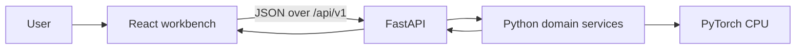
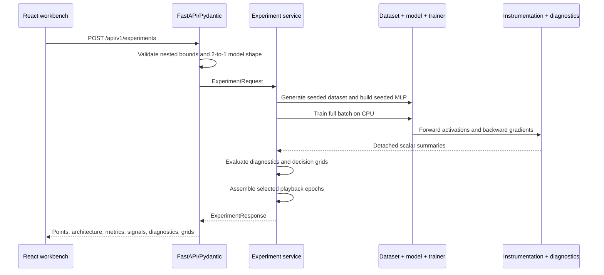

# Architecture

NeuronScope is a modular monolith with one browser client and one Python API. The deployment unit is
small, but its internal boundaries keep HTTP, domain logic, PyTorch execution, observation, and
presentation independently testable.

## System context



During local development Vite serves the frontend and proxies `/api` to Uvicorn on
`127.0.0.1:8000`. The applications do not require a database, worker, message broker, or external ML
service.

## Backend boundaries

| Package | Responsibility |
| --- | --- |
| `api` | HTTP routing and response-model enforcement |
| `core` | Process configuration loaded from `NEURONSCOPE_*` environment values |
| `datasets` | Seeded generation of typed 2D binary-classification points |
| `models` | Validated MLP configuration, deterministic construction, and serializable architecture metadata |
| `training` | Full-batch CPU optimization, metrics, and selected model-state capture |
| `instrumentation` | Removable hooks and immediate tensor-to-scalar summaries |
| `diagnostics` | Configurable deterministic rules over instrumentation evidence |
| `experiments` | Use-case orchestration, decision-grid inference, and bounded playback assembly |

Domain modules do not depend on FastAPI. The experiment service can therefore be called directly by
tests or another trusted Python adapter without constructing an HTTP request.

## Experiment lifecycle



Pydantic rejects invalid dataset sizes, layer counts and widths, learning rates, epoch counts,
boundary resolution, diagnostic thresholds, and playback caps before orchestration. Training uses
`BCEWithLogitsLoss` and either SGD or Adam. Post-update loss and accuracy are recorded for every
epoch.

## Observation and memory discipline

Instrumentation attaches forward hooks only to hidden activations. Tensor outputs are detached and
reduced immediately to JSON-safe mean, standard deviation, range, zero percentage, and non-finite
counts. Parameter gradients and weight norms are likewise summarized after backpropagation. Hooks
are removed in a `finally` block so repeated runs do not accumulate observers or retain computation
graphs.

Playback selects the first epoch, final epoch, and a capped set of evenly spaced epochs between
them. Only those temporary model states are cloned on CPU. The service evaluates each selected state
on one bounded coordinate grid, restores the final model, and returns probabilities plus scalar
observations—not parameters or arbitrary tensors.

Diagnostics remain downstream of raw observations:

```text
instrumentation -> configured rule -> evidence + severity + explanation + possible actions
```

The rule engine currently checks sustained tiny gradients, sustained large gradients, non-finite
gradients, and sustained high ReLU zero percentages. Thresholds are explicit configuration, not
claims of universal mathematical truth.

## Frontend boundaries

- `api/experiments.ts` owns the typed HTTP contract and error extraction.
- `App.tsx` owns configuration, request lifecycle, cancellation, completed-run selection, and panel
  composition.
- `components/networkGraph.tsx` transforms real architecture metadata into bounded React Flow nodes
  and edges.
- Boundary, metrics, layer-signal, diagnostic, playback, and run-comparison components render only
  response data supplied to them.
- Configuration parsing and validation are pure functions shared with component tests.

The latest five successful responses live only in browser memory. An `AbortController` and request
identifier prevent cancelled or stale responses from replacing visible state, although the current
synchronous backend has no server-side job preemption.

## Determinism and operational limits

Seeds control dataset generation and model initialization without advancing caller-global random
state. Full-batch CPU training avoids shuffle order and GPU-kernel variability. Repeated equivalent
runs are tested for deterministic behavior within one supported environment, while cross-platform
bit-for-bit equality is not promised.

The intentional bounds—2D generated data, binary output, at most 2,000 samples, at most eight
256-neuron hidden layers, at most 5,000 epochs, an 80-by-80 decision grid, and at most 24 playback
snapshots—keep synchronous execution and response size appropriate for an educational debugger.

Arbitrary uploaded PyTorch models are outside the current trust boundary. Supporting them later
requires an explicit design for serialization, dependency isolation, resource control, and untrusted
code execution; the existing API must not be treated as a general model runner.
